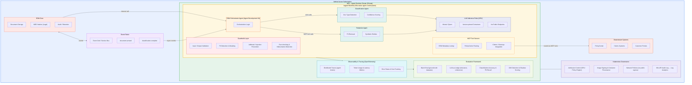

# Admiral Azure – EDM Agent Runtime Architecture

```mermaid
graph TB
    subgraph AzureSub["Admiral Azure Subscription"]

        subgraph EDMCore["EDM Core"]
            DS["Document Storage"]
            MD5["MD5 Hashes (Legal)"]
            AuditRet["Audit / Retention"]
        end

        subgraph EventFabric["Event Fabric"]
            EG["Event Grid / Service Bus"]
            DocArrived["document-arrived"]
            ClassComplete["classification-complete"]
        end

        EDMCore <-->|"events"| EventFabric

        subgraph AKS["AKS – Agent Runtime Cluster (Private)"]

            subgraph kagent["kagent Runtime (K8s-native agent control plane)"]

                subgraph Orchestrator["EDM Orchestrator Agent (Agent Development Kit)"]
                    OrcNode["Orchestration Logic"]
                end

                subgraph ClassAgent["Classification Agent"]
                    DocType["Doc Type Detection"]
                    Confidence["Confidence Scoring"]
                end

                subgraph RedactAgent["Redaction Agent"]
                    PII["PII Removal"]
                    Synth["Synthetic Entities"]
                end

                Orchestrator -->|"A2A calls"| ClassAgent
                Orchestrator -->|"MCP tool calls"| RedactAgent

                subgraph LLM["LLM Inference Pods (GPU)"]
                    Mistral["Mistral / Qwen"]
                    Pinned["Version-pinned Containers"]
                    NoPublic["No Public Endpoints"]
                end

                ClassAgent --> LLM
                RedactAgent --> LLM

                subgraph MCPTools["MCP Tool Servers"]
                    EDMMeta["EDM Metadata Lookup"]
                    PolicyRoute["PolicyCenter Routing"]
                    ClaimsInt["Claims / Genesys Integration"]
                end

                subgraph Guardrails["Guardrails Layer"]
                    IOValid["Input / Output Validation"]
                    PIIDetect["PII Detection & Masking"]
                    Jailbreak["Jailbreak / Injection Prevention"]
                    FactCheck["Fact-checking & Hallucination Detection"]
                end
            end

            subgraph Observability["Observability & Tracing (OpenTelemetry)"]
                Traces["Distributed Traces (agent chains)"]
                Metrics["Token Usage & Latency Metrics"]
                Errors["Error Rates & Cost Tracking"]
            end

            subgraph EvalFramework["Evaluation Framework"]
                BatchEval["Batch Eval (ground-truth datasets)"]
                LLMJudge["LLM-as-Judge (relevance, coherence)"]
                ClassAccuracy["Classification Accuracy & PII Recall"]
                Drift["Drift Detection & Shadow Scoring"]
            end

            kagent --> Observability
            Observability --> EvalFramework
        end

        EDMCore -->|"internal call"| Orchestrator
        EventFabric -->|"async events"| Orchestrator

        subgraph K8sGov["Kubernetes Governance"]
            OPA["Admission Control (OPA / Policy Engine)"]
            ImageSign["Image Signing & Container Provenance"]
            NetPol["Network Policies (no public egress)"]
            AuditLog["K8s API Audit Log → Log Analytics"]
        end

        AKS --- K8sGov

        subgraph Downstream["Downstream Systems"]
            PolicyCenter["PolicyCenter"]
            Claims["Claims Systems"]
            CustomerPortals["Customer Portals"]
        end

        MCPTools -->|"routed via MCP tools"| Downstream
    end

    style AzureSub fill:#e8f0fe,stroke:#4285f4,stroke-width:2px,color:#000
    style AKS fill:#e6f4ea,stroke:#34a853,stroke-width:2px,color:#000
    style kagent fill:#fef7e0,stroke:#f9ab00,stroke-width:2px,color:#000
    style EDMCore fill:#fce8e6,stroke:#ea4335,stroke-width:1px,color:#000
    style EventFabric fill:#f3e8fd,stroke:#a142f4,stroke-width:1px,color:#000
    style Orchestrator fill:#fff3e0,stroke:#e65100,stroke-width:1px,color:#000
    style ClassAgent fill:#e0f2f1,stroke:#00796b,stroke-width:1px,color:#000
    style RedactAgent fill:#e0f2f1,stroke:#00796b,stroke-width:1px,color:#000
    style LLM fill:#e8eaf6,stroke:#283593,stroke-width:1px,color:#000
    style MCPTools fill:#fff8e1,stroke:#f57f17,stroke-width:1px,color:#000
    style Guardrails fill:#ffebee,stroke:#c62828,stroke-width:1px,color:#000
    style Observability fill:#e0f7fa,stroke:#00838f,stroke-width:1px,color:#000
    style EvalFramework fill:#f1f8e9,stroke:#558b2f,stroke-width:1px,color:#000
    style K8sGov fill:#ede7f6,stroke:#4527a0,stroke-width:1px,color:#000
    style Downstream fill:#fbe9e7,stroke:#bf360c,stroke-width:1px,color:#000
```
